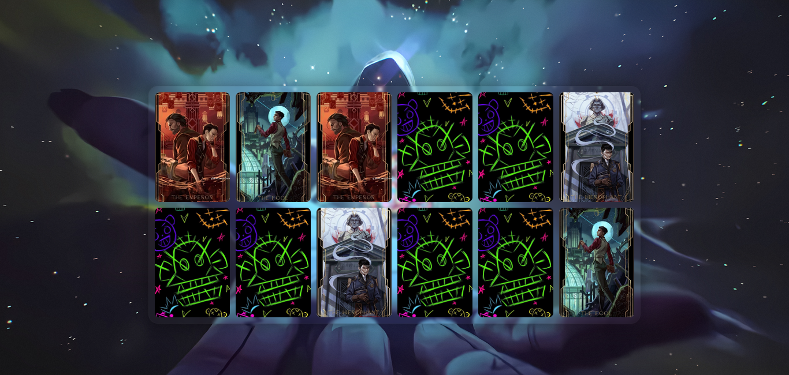

# Memory Game — *Arcane*

> Mini-jeu réalisé dans le cadre d'une **game jam** au centre de formation Simplon — projet pédagogique.

---

## Présentation

<p align="center">
  
</p>

Ce Memory Game est inspiré de l'univers d'**Arcane**. Il s'agit d'un petit jeu web développé en **HTML5**, **CSS3** et **TypeScript** pour mettre en pratique la manipulation du DOM, l'algorithmie de base, la Programation Orientée Objet (POO) et le versionnement Git.

**Objectif pédagogique :** réaliser une application web complète (analyse, prototype, développement, mise en ligne) en respectant un thème rétro / rétro‑futuriste.


---

## Règles du jeu

- Toutes les cartes sont placées face cachée sur le plateau de jeu.
- À chaque tour, vous pouvez retourner deux cartes.
- Si les deux cartes retournées sont identiques, elles restent face visible.
- Si les deux cartes retournées sont différentes, elles sont à nouveau retournées face cachée après un court délai.
- Le jeu continue jusqu'à ce que toutes les paires aient été trouvées.

**Contrôles :**
- Souris / tactile : cliquer ou toucher.

---

## Fonctionnalités

- Thème visuel inspiré de l'univers d'Arcane.
- Animations d'ouverture et fermeture des cartes.
- Accessibilité : navigation clavier, focus visible, rôles ARIA.
- Code TypeScript structuré.

---

## Stack technique

- HTML5 sémantique
- CSS3 (Flexbox / Grid)
- TypeScript
- Programmation Orientée Objet (POO)
- Outils de build (config `tsconfig.json`)
- Git (commits quotidiens avec messages explicites)

---

## Structure du projet

```

brief_3/ 
├─ assets/          # images, fonts
├─ dist/            # build pour déploiement
├─ src/             # code source TypeScript
│  ├─ main.ts
│  ├─ Card.ts
│  └─ Board.ts
├─ index.html
├─ style.css
├─ package.json
├─ tsconfig.json
└─ README.md

````
---

## Mentions légales

Ce projet est une création **fan-made à but éducatif uniquement**.

Tous les droits lié à *Arcane* et à l'univers de *League of Legends* sont détenus par :

- **Riot Games, Inc...**

Les images et contenus utilisés sont soumis au **fair use** à des fins d’apprentissage, d’analyse et de critique.  
Aucun bénéfice commercial n’est tiré de cette création.

---

